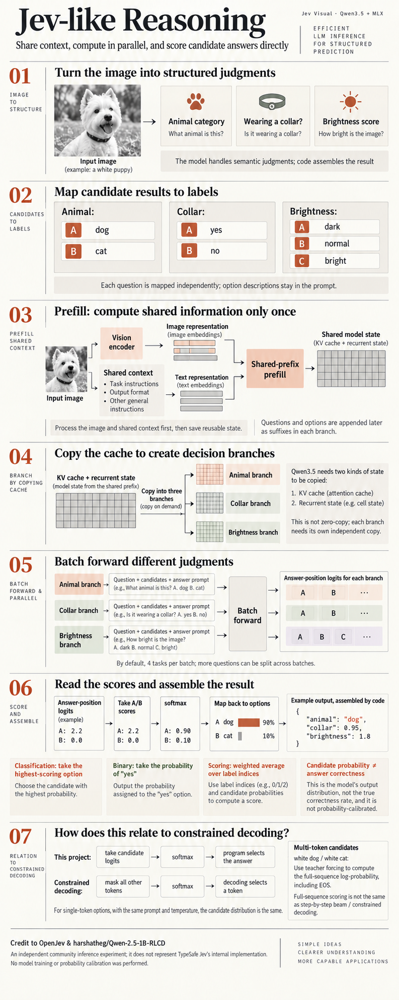

# Jev Visual

**Credit to [OpenJev](https://github.com/TheoLeeCJ/openjev) and [harshatheg/Qwen-2.5-1B-RLCD](https://huggingface.co/harshatheg/Qwen-2.5-1B-RLCD)** for the candidate-scoring and shared-context ideas. [Detailed credits and licenses](THIRD_PARTY.md).

English · [简体中文](README.zh-CN.md)

A small, runnable project for learning **vision-language model inference on Apple Silicon**. Use Qwen3.5-0.8B with MLX to answer multiple questions about one image: choose an option, judge yes/no, or score ordered levels. Includes a local browser UI, CLI and HTTP API.

> This project explores a Jev-like inference pattern for open multimodal language models. It avoids autoregressive structured generation by reusing shared multimodal context and directly scoring candidate outputs from model logits.
>
> This is an independent community implementation and does not claim to reproduce TypeSafe Jev's proprietary model architecture, RLCD training, calibration, or serving system.

## Inference overview



## Run locally

Requires an **Apple Silicon Mac with Metal**. Tested on M4 / 16GB, macOS 15.1, Python 3.13.1. First setup downloads dependencies and approximately 596 MiB of model weights; inference then runs locally.

From the repository root:

```bash
# If needed, install uv with Homebrew: brew install uv
uv venv --python 3.13
source .venv/bin/activate
uv pip install -r requirements-lock.txt
uv pip install --no-deps -e .
jev-visual-download

JEV_VISUAL_MODEL_PATH=.models/Qwen3.5-0.8B-4bit \
  uvicorn jev_visual.server:app --host 127.0.0.1 --port 8788
```

Open **http://127.0.0.1:8788**, upload an image and click **Analyze image**. Use one worker; first inference may be slower. This server is for local use. API docs: `/docs`.

Or try the included request:

```bash
jev-visual examples/photo-request.json --model-path .models/Qwen3.5-0.8B-4bit
```

## Learn the inference path

```text
image + context → shared prefill → fork cache → batch question suffixes
                → read candidate scores → assemble typed answers in code
```

Read the code in this order:

1. [preprocessing.py](jev_visual/preprocessing.py): image preparation, prompts and token boundaries.
2. [adapters.py](jev_visual/adapters.py): vision encoding, prefill, KV/recurrent-state reuse and the LM head.
3. [scoring.py](jev_visual/scoring.py): A/B/C labels, native single tokens and complete sequence log-probabilities, including EOS.
4. [schema.py](jev_visual/schema.py) → [engine.py](jev_visual/engine.py): normalize candidate scores, assemble results and coordinate execution.

This uses existing weights; no training or calibration. Candidate probabilities are relative to supplied options, **not correctness estimates**. Only the Qwen3.5 adapter is verified. Cache sharing is within one request and copies state; it is not zero-copy sharing. Supports 1–64 questions, 2–26 options each.

[Inference details](docs/inference.md) · [Request examples, Python API and tests](docs/usage.md)

## Visual game demos

Open [/demo/](http://127.0.0.1:8788/demo/) on the running local server for the sorting factory, camera gesture console and a 2×2 cube. Each action uses only a canvas screenshot plus fixed rules; the sidebar shows inputs and action probabilities. Manual and model controls are included. The cube is a limitation demo: the current model cannot reliably solve it in the default non-thinking, direct-scoring mode. [Setup, tests and limitations](demo/README.md).

## Compare and verify

With the environment activated and model downloaded, stop the server before benchmarking:

```bash
python -m pytest -q                # Unit/API tests; no model inference
python -m examples.verify_scoring  # Compare scores against full model forwards
python -m benchmarks.run
python -m benchmarks.report
```

The benchmark compares **generate JSON → independent candidate scoring → shared-prefix batched scoring**, at **1 / 4 / 16 / 64 decisions**, with three repetitions and model loading/warmup excluded. New outputs go to `artifacts/`.

The recorded M4 / 16GB run took **37.30s → 2.40s** for independent versus shared scoring at 64 decisions (medians). Generated JSON failed the complete schema at 4/16/64 decisions; its timing is not successful-completion latency. This is a scaling experiment, not an accuracy evaluation or Jev comparison.

[Benchmark method](benchmarks/README.md) · [Results and metrics](benchmarks/RESULTS.md) · [Raw records](benchmarks/results.json)

Original code: [MIT](LICENSE). Third-party licenses: [notices](THIRD_PARTY.md).
