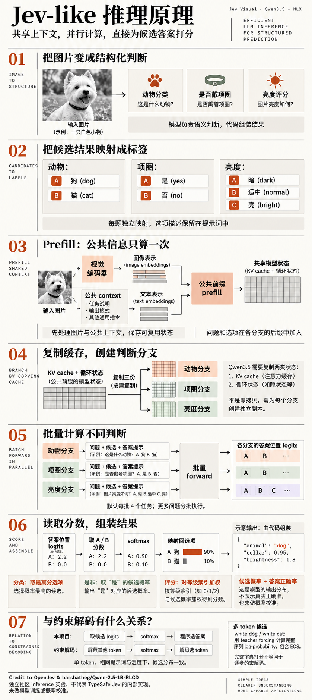
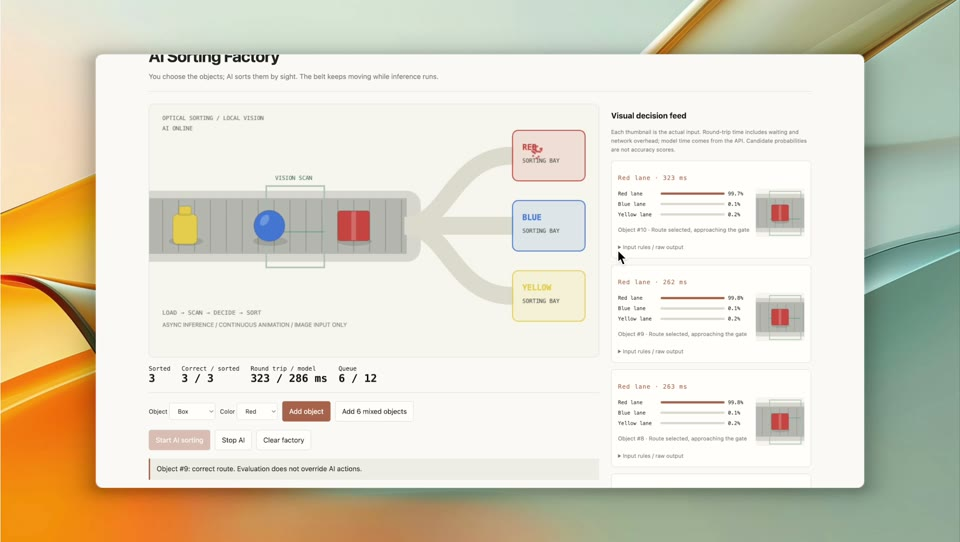
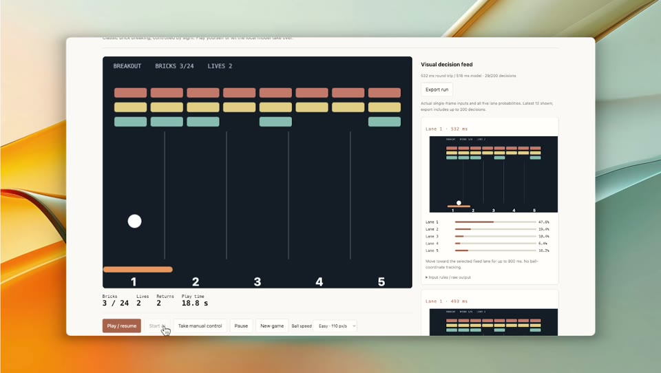

# Jev Visual

**首先致谢 [OpenJev](https://github.com/TheoLeeCJ/openjev) 和 [harshatheg/Qwen-2.5-1B-RLCD](https://huggingface.co/harshatheg/Qwen-2.5-1B-RLCD)**，本项目借鉴了它们的候选打分与共享上下文思路。[完整致谢与许可](THIRD_PARTY.md)。

[English](README.md) · 简体中文

一个在 **Apple Silicon Mac 上学习视觉语言模型 inference（推理）** 的小项目。使用 Qwen3.5-0.8B 和 MLX，对同一张图片回答多个问题：选择选项、判断是非、为有序等级打分。提供本地网页、CLI 和 HTTP API。

> 本项目探索 Jev-like 的推理方式：复用多模态上下文，直接读取模型 logits 为候选答案打分，由代码组装结构化结果。
>
> 这是独立社区的 inference 实验，不代表 TypeSafe Jev 的真实原理，也不复现其私有模型架构、RLCD 训练、概率校准或服务系统。

## 推理原理图



## 本地启动

需要支持 Metal 的 **Apple Silicon（M 系列）Mac**。已在 M4 / 16GB、macOS 15.1、Python 3.13.1 验证。首次安装需联网下载依赖和约 596 MiB 权重，之后推理在本地运行。

在项目根目录执行：

```bash
# 如未安装 uv，可通过 Homebrew 安装：brew install uv
uv venv --python 3.13
source .venv/bin/activate
uv pip install -r requirements-lock.txt
uv pip install --no-deps -e .
jev-visual-download

JEV_VISUAL_MODEL_PATH=.models/Qwen3.5-0.8B-4bit \
  uvicorn jev_visual.server:app --host 127.0.0.1 --port 8788
```

打开 **http://127.0.0.1:8788**，上传图片，点击 **Analyze image**。只运行一个 worker，首次推理可能较慢。服务供本机使用，API 文档在 `/docs`。

也可以运行示例请求：

```bash
jev-visual examples/photo-request.json --model-path .models/Qwen3.5-0.8B-4bit
```

## 沿着代码学习推理

```text
图片 + 上下文 → 共享 prefill → 复制缓存 → 批量计算各题后缀
             → 读取候选分数 → 代码组装结构化答案
```

建议按以下顺序阅读：

1. [preprocessing.py](jev_visual/preprocessing.py)：图片处理、提示词与 token 边界。
2. [adapters.py](jev_visual/adapters.py)：视觉编码、prefill、KV／循环状态复用，以及 LM head。
3. [scoring.py](jev_visual/scoring.py)：A/B/C 标签、原生单 token、包含 EOS 的完整序列 log-probability。
4. [schema.py](jev_visual/schema.py) → [engine.py](jev_visual/engine.py)：归一化候选分数、组装结果和串联流程。

使用现成权重，未做训练或校准。候选概率只表示给定选项之间的相对偏好，**不等于答案正确率**。目前只验证了 Qwen3.5 adapter；缓存在单次请求内复用，需要复制状态，并非零拷贝。支持 1–64 题，每题 2–26 个选项。

[推理实现详解](docs/inference.md) · [请求示例、Python API 与测试](docs/usage.md)（英文）

## 视觉游戏 Demo

点击封面查看录屏：

| AI 分拣工厂 | 打砖块 |
|---|---|
| [](docs/demo/demo_factory.mp4) | [](docs/demo/demo_brick.mp4) |
| [查看视频](docs/demo/demo_factory.mp4) | [查看视频](docs/demo/demo_brick.mp4) |

分拣工厂让模型识别传送带上物品的截图，选择分拣通道；右侧展示真实输入和候选概率。

**打砖块暴露了 Qwen3.5-0.8B-4bit 在当前非思考、直接打分模式下的能力不足。** 直接要求追球或选择左／右并不可靠：模型可能连续选择同一方向，把挡板推到边界。最终采用的方案是降低任务难度：

1. 使用单张完整截图，增大小球和挡板，并降低 Easy 模式球速。
2. 在画面上标出五个编号区域，只问模型：**球在哪个区域？**
3. 程序把挡板移动到该区域的固定中心。移动控制只读取挡板位置，不读取球坐标；人也能使用相同的目标位置按钮。

这样把游戏控制简化为视觉分类，没有隐藏的自动追球器或求解器。另一次已记录的测试中，80 次决策打掉 **9 块砖、接回 6 次球，剩余 2 条命**，测试主动截停，尚未通关。这是经过简化的 Demo，不能代表通用游戏能力；也没有对照实验能将不足单独归因于 4-bit 量化。[实现与实测记录](demo/breakout/README.md)。

启动本地服务后打开 [/demo/](http://127.0.0.1:8788/demo/)，还可以体验摄像头手势控制台和二阶魔方。当前模型无法可靠复原魔方。Demo 界面与说明使用英文。[运行、测试与限制](demo/README.md)。

## 对照实验与验证

激活环境、下载模型后执行；benchmark 前请先停止服务：

```bash
python -m pytest -q                # 单元/API 测试，无需模型推理
python -m examples.verify_scoring  # 对照完整模型 forward 验证分数
python -m benchmarks.run
python -m benchmarks.report
```

Benchmark 比较 **生成 JSON → 逐题候选打分 → 共享前缀批量打分**，覆盖 **1／4／16／64 题**，每组重复 3 次，排除模型加载和预热。新结果写入 `artifacts/`。

已记录的 M4 / 16GB 实验中，64 题逐题打分与共享打分的中位耗时为 **37.30 秒 → 2.40 秒**。生成 JSON 在 4／16／64 题下未通过完整 schema 校验，不能把它的耗时视为成功完成任务的耗时。这是计算规模实验，不是准确率评测或与 Jev 的对比。

[Benchmark 方法](benchmarks/README.md) · [结果与指标](benchmarks/RESULTS.md) · [原始记录](benchmarks/results.json)

原始代码使用 [MIT 许可证](LICENSE)，第三方许可见[相关说明](THIRD_PARTY.md)。
